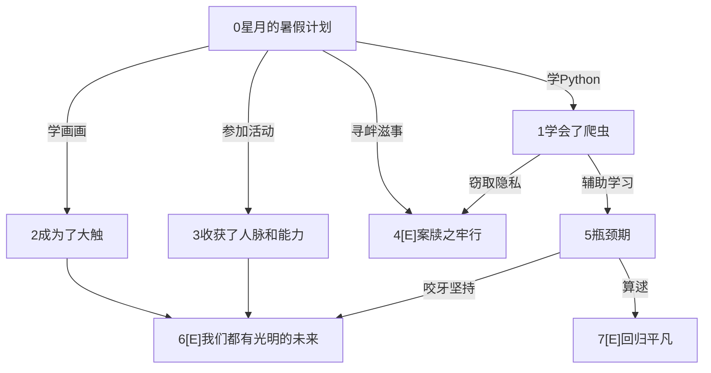

## 全局变量定义

云存储根目录完整url：

```js
cloudpath: 'cloud://cloud1-5gb77mtq8dcc1698.636c-cloud1-5gb77mtq8dcc1698-1307133896',
```

五种类别常量(类别下标和文字一一对应)：

```js
type_p: ['感情', '学习', '心灵', '职业', '校园热点', '全部'],
```

互动视频相关变量：(动态读取数据库加载)

```js
info_video: [],
num_video: 0,
```

数据库单次读取记录条数上限常量：

```js
 batch: 20,
```


## 云开发目录结构

### 云开发

#### video

存储视频对象(见下文)

### 云存储

#### video

存储视频格式：强制要求mp4 (读取方便 且 兼容性高)

命名格式：`v`+视频id+`-`+片段id 如`v2-3`

特殊视频片段：

- `fail1` 视频加载失败时显示的视频片段


#### videoposter

视频封面，没有后缀要求(常见图片后缀均可，甚至没有封面名字命名要求，但推荐以视频id为名字)

特殊封面：

- `unknown_poster.jpg` 默认/未知封面


#### avatar

用户头像，没有后缀要求(常见图片后缀均可，但推荐以用户id为名字)

特殊头像：

- 


## 小剧场

### 整体结构

#### 视频数据结构

视频片段组成DAG

每个视频片段是一个节点，根节点(起始片段)编号为0

出度为0的节点是结局，显示节点标题

存图使用邻接表存边


#### 视频对象

1. id string

   所有对象的id从0开始递增，是string(但是本质是数字)

2. title string

3. up string 发布者ID

4. type number 类型下标

5. time date

6. click number

7. poster string (相对路径url，不包含文件夹的完整文件名如`0.jpg`)

8. node array套object  暂时不实现

   - title string 节点名字

9. clipname array(string) 节点名字(替代8)

10. edge array套array套object：

    - id number 跳转的片段ID
    - info string 选项信息


注：

- 重新进入小程序才会刷新视频的浏览次数。
- 当type不是0~4整数时，表示该视频被删除(因为无法通过正常途径看到该视频)。建议把type=-1当作被删除类型。


### 样例视频结构示意图

#### 0




## 用户板块

### 整体结构

#### 用户对象

1. id string
2. name string 要求length不超过20
3. school string 学校信息(选填) 要求length不超过40
4.  motto string 个性签名 要求length不超过80

#### 


## 更新日志

2021-8-25

1. 完成了互动视频的核心部分，可以正常实现互动的所有逻辑 (暂未支持全屏)
2. 制作了一个简陋的互动视频样例

2021-8-26

1. 增加了若干细节：
   - 实现了点击增加浏览次数
   - 现在支持非互动视频
   - 现在视频片段均自动播放、且新增支持拖动画面以拖动进度条
2. 


其他：

[云开发文档](https://developers.weixin.qq.com/miniprogram/dev/wxcloud/basis/getting-started.html)


