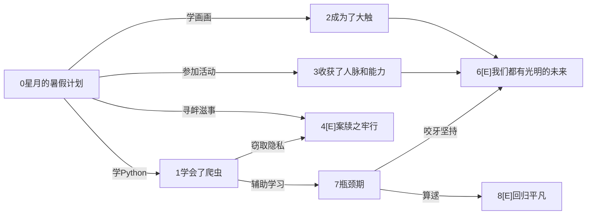

## 全局变量定义

云存储根目录完整url：

```js
cloudpath: 'cloud://cloud1-5gb77mtq8dcc1698.636c-cloud1-5gb77mtq8dcc1698-1307133896',
```

五种类别常量(类别下标和文字一一对应)：

```js
type_p: ['感情', '学习', '心灵', '职业', '校园热点'],
```


## 云开发目录结构

### 云存储

#### video

存储视频格式：强制要求mp4 (读取方便 且 兼容性高)

命名格式：`v`+视频id+`-`+片段id 如`v2-3`


## 小剧场

### 整体结构

#### 视频数据结构

视频片段组成DAG

每个视频片段是一个节点，根节点(起始片段)编号为0

出度为0的节点是结局，显示节点标题

存图使用邻接表存边


#### 视频对象

1. id string

   所有对象的id从0开始递增，是string(但是本质是数字)

2. title string

3. up string 发布者ID

4. type number 类型下标

5. time date

6. click number

7. poster string(url) 暂时不实现

8. node array套object

   - title string 节点名字

9. edge array套object：

   - id string 跳转的片段ID
   - info string 选项信息


#### 样例视频结构示意图

##### 0




其他：

[云开发文档](https://developers.weixin.qq.com/miniprogram/dev/wxcloud/basis/getting-started.html)

