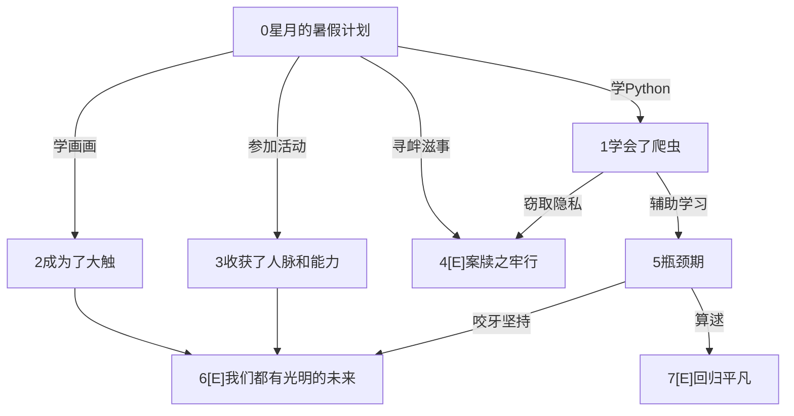

## 全局变量定义

云存储根目录完整url：

```js
cloudpath: 'cloud://cloud1-5gb77mtq8dcc1698.636c-cloud1-5gb77mtq8dcc1698-1307133896',
```

五种类别常量(类别下标和文字一一对应)：

```js
type_p: ['感情', '学习', '心灵', '职业', '校园热点', '全部'],
```

互动视频相关变量：(动态读取数据库加载)

```js
info_video: [],
num_video: 0,
```

数据库单次读取记录条数上限常量：

```js
batch: 20,
```

用户ID和信息： (-1是未登录，否则是用户对象的openid)

```js
openid: '',
info_user: null,
```

up主下标(即ID)对应的昵称和头像url信息：

```js
info_up: [],
```

推荐视频的下标和数量(常量)：

```js
info_recommend: [],
num_recommend: 4,
```

海报图片完整路径：

```js
info_placard: [],
```

所有帖子： (反正就算几十万字也就几MB而已，一并读取算了)

```js
info_post: [],
num_post: 0,
```

所有用户：(对于非自己的人，代码上只调用昵称和头像) (区别于上文info_user)

```js
info_users: [],
num_users: 0,
```

用户未读信息数：

```js
num_newmessage: 0,
```

商品信息：

```js
info_goods: [],
```


> 当num_post或num_user过多时，未来版本可能会撤销info_post和info_user以降低用户流量消耗(但是代价是每点一个东西都要加载半天，因为缺乏了预加载)


## 云开发目录结构

### 云开发

#### video

存储视频对象(见下文)

#### user

存储用户对象(见下文)

#### global

##### default

项目：

1. num_video number
2. up array([string, string]) 下标(UP主ID)对应的UP主昵称和头像完整url
3. recommend array(string) 推荐的互动视频下标
4. placard array(string) 海报图片(相对路径)
5. goods array(array) 商品信息(见下文描述)

### 云存储

#### video

存储视频格式：强制要求mp4 (读取方便 且 兼容性高)

命名格式：`v`+视频id+`-`+片段id 如`v2-3`

特殊视频片段：

- `fail1` 视频加载失败时显示的视频片段


#### videoposter

视频封面，没有后缀要求(常见图片后缀均可，甚至没有封面名字命名要求，但推荐以视频id为名字)

特殊封面：

- `unknown_poster.jpg` 默认/未知封面


#### avatar

用户头像，没有后缀要求(常见图片后缀均可)，默认上传的系统给起是什么名字就是什么名字

特殊头像：

- `unknown_user.jpg` 默认/未知用户


#### placard

海报图片，没有文件名要求

海报轮播图和海报内部图片均存放在这里


#### postpic

帖子图片，常见图片后缀均可，没有文件名要求，默认上传的系统给起是什么名字就是什么名字


#### goods

商品图片，常见图片后缀均可，没有文件名要求


### 云函数

getOpenId 


## 小剧场

### 整体结构

#### 视频数据结构

视频片段组成DAG

每个视频片段是一个节点，根节点(起始片段)编号为0

出度为0的节点是结局，显示节点标题

存图使用邻接表存边


#### 视频对象

1. id string

   所有对象的id从0开始递增，是string(但是本质是数字)

2. title string

3. up string 发布者ID(见全局变量)

4. type number 类型下标

5. time date

6. click number

7. poster string (相对路径url，不包含文件夹的完整文件名如`0.jpg`)

8. node array套object  暂时不实现

   - title string 节点名字

9. clipname array(string) 节点名字(替代8)

10. edge array套array套object：

    - id number 跳转的片段ID
    - info string 选项信息


注：

- 重新进入小程序才会刷新视频的浏览次数。
- 当type不是0~4整数时，表示该视频被删除(因为无法通过正常途径看到该视频)。建议把type=-1当作被删除类型。


### 样例视频结构示意图

> 仅展示有意义的样例视频

#### 0




## 树洞

### 整体结构

#### 帖子对象

1. _id string 格式为：
2. title string 标题，限长30字符
3. abbr string 摘要(显示在树洞页)，限长80字符
4. type number 0~4是正常类别 
5. time_publish Date
6. time_active Date
7. click number
8. user string 即user的ID/openid
9. content string 富文本，即HTML文本
10. replyto number 回复的帖子ID
11. reply array(number) 跟帖帖子ID(按楼层数字顺序，维护有序)
12. parent number 被回复的帖子ID


#### 页面options要求和意见

> 摘自代码(新版本以代码为准)

```js
/*如果什么都没有，就是发布新帖子
 如果带edit关键字就是编辑模式
 编辑模式下需要带id关键字，带被编辑帖子id
 如果带fid关键字，就是跟帖，且被回的帖子id是fid
 带fid关键字的情况下，必然带ftitle关键字，即被跟帖的标题
 如果带rid关键字，就是回复帖子，且被回复帖子id是rid，rid出现的充分条件是fid出现
 带rid关键字的情况下，必然带rfloor关键字，即被回复楼层
 带rid关键字的情况下，必然带rname关键字，即被回复人昵称
 事实上rfloor,rname,ftitle可以不传入，但是这里传入是考虑到未来可能删去info_user和info_post将不再可以获取信息
 另：假设能够点击进入该页面的人都是已经登陆的用户
 然而由于openid这破玩意实在是太长了……塞两个(跟帖和回帖同时)url忍不下，所以并不能页面传递openid
 在删除了info_post情况下考虑每读到一个帖子情况下每次数据库读到的东西都存起来，记忆化大模拟ex吐了*/
```


#### 帖子ID分配的改进意见

原方案(心行+学舟)这种点进发帖页面发表新帖先临时占用一个帖子ID的做法会缺点：

1. 用户强退时该帖子ID将会被永久无效占领
2. 恰好多个用户同一时间点击发帖按钮时会占用同一个ID而导致bugs

并且第一个问题会引发新的bugs：

1. 无效的ID会在预处理时占用大量的无效读取次数，甚至导致读取失败报错崩溃

未来版本的一个ID分配设想如下：

1. 帖子ID使用较长的等长随机大小写和数字字符(类似于openID)等，可以：
   - 随机刷等长普通字符(英文数字下划线)
   - 用户ID+`_`+用户帖子序号 (但是还需要保存帖子序号，考虑到删除问题)
   - 用户ID+随机刷 (还不如直接刷)
   - 当前时间戳
2. 点击发帖时什么也不做，点击确认发帖时才上交服务器

现在由于图片使用了随机字符，不再需要固定格式，所以分配设想的第二点可行，所以现在采用第二点方案。取消学舟的预分配策略。可以解决上述bugs。

考虑到延迟问题(只采用第二个时，分配的ID如果还是有序，那么会有时差，即假设在4h登录，5h有人发两个帖，自己在6h发一个帖，那么这个帖子将会覆盖那个人发的第一个帖子)，所以仍然需要使用随机ID。或者用自己的id计数。代价是批量读取数据时比较麻烦。

用户id+序号的缺点是麻烦，而且id太长，因为用户id很长，而用户id不能截断，因为会有很多用户前缀一致。开哈希截断又麻烦。而且还要统计用户ID后面的随机或计数。当然事实上是可以直接无脑随机刷一个随机字符的。

或者有一个新的方案：直接用当前时间作帖子ID，这样有很多事实上的好处。总的来说胜过上述的方案。时间戳的好处是几乎不会重复，因为精确到了毫秒，而且排序方便，而且也不是特别长(与openid相比)。


#### 删帖的处理意见

由于之前数据结构规划时疏忽了，导致现在要做真删除需要处理几个麻烦的事情，但是并不是不可战胜：

1. 楼层序号计数

   在不考虑删帖时，序号就是本来的编号，考虑之后假设真删reply列表，序号就会出错，所以reply列表只能保留几个虚假id(已被删去的)，然后特判一下

2. 全局读取帖子

   真删除还是要更新num_post，读取时做一个where筛选；假删除都不用做

   同时，跟帖数的统计不能直接取length了，需要遍历一次reply统计

   其实上面那个操作让帖子加一个valid_replynum更好的，但是现在改来不及了，以后重构其他论坛的时候再考虑吧

3. 关联处理

   user那里可以直接pop掉；真假删除都要做

4. 主贴被删除了，用户查看自己发表的跟帖是进入的页面

   需要设定：自己是否还能看这个跟帖，想设置为可以看

   同时有一个子问题，主贴被删除了，用户查看自己发表的回帖，被回的帖子尚未被删除，自己能否看到自己所回复的内容，想设置为也可以看

   当然最图省事的方法是都设置为不可以，那就屁事都没有……

   假删除的情况下，只需要设置主贴不可见，其reply还是可见的。但是真删除把主贴整个扬掉了，进行溯源只能是DFS一个回复链表出来，或者只找一次一个节点

   鉴于本功能的实用意义还不如搜索功能，所以打算采用最图省事的方法了……真的有需要以后的迭代版本再改吧，毕竟连搜索你都不做


## 用户板块

### 整体结构

#### 用户对象

1. id string 与openid和_id一致
2. _openid string  数据库记录创建时自动生成的
3. name string 要求length不超过某个值
4. school string 学校信息(选填) 要求length不超过40 暂时不实现
5. motto string 个性签名 要求length不超过某个值
6. point number 积分
7. warehouse Object(number:number) 仓库(key是商品id，值是数目)
8. appointment_talk array(元素为number)
9. appointment_vr array(元素为number)
10. star_video array(元素为[string,date]) 下文排序均由时间近到远，维护有序
11. star_post array(元素为[string,date])
12. history_video array(元素为[string,date])
13. history_post array(元素为[string,date])
14. post array(string) 发表的帖子
15. message array([Boolean, string, string]) 是否未读，回帖人，被回帖子
16. avatar 头像url(完整地址)


正常代码功能下不会删除用户，所以可以保证一定不会对一个openid出现找不到该用户信息的状况。


#### 批量页面

由于收藏和浏览记录实现逻辑几乎一致，所以两个页面实质上共用代码逻辑，所以js代码是统一的。两个页面的data数据详见代码。


## 首页

### 商店

#### 商品对象

格式：数组，每个元素是一个商品，也是数组，格式如下：

- 0: number 剩余数量 
- 1: number 单价
- 2: Boolean 是否有限
- 3: string 商品名
- 4: string 商品描述
- 5: string 商品图(完整url)(反正相对url也省不了多少内存反而麻烦死了)


### 预约

继续使用(写起来非常爽的)批量页面生成

#### 日期对象

采用年月日日期，仍然用Date(反正没有设置时分秒那就都是一样的)

由于js对日期对象同一时刻判定为不相等，所以数据上保存记录时间戳


### 海报

因为没实际意义和海报数目过少，我们删除了海报功能


## 变更说明

1. 除部分标注了`(不保证完成)`的功能外，我们完成了所有功能
2. 由于海报数目只有两张且没有实际意义，轮播起来效果很差，所以我们删除了首页的海报轮播功能。
3. 由于联系客服页面内容极少，我们将其合并到了查看帮助页面内。


## 改进意见

1. 目前在帖子主页下拉后点击下方新加载出来的帖子然后返回时，只保留了未下拉状态。建议删除帖子时才更新帖子列表，否则不作任何改变。做这样的优化可能可以保留下拉功能。


## 更新日志

2021-8-25

1. 完成了互动视频的核心部分，可以正常实现互动的所有逻辑 (暂未支持全屏)
2. 制作了一个简陋的互动视频样例

2021-8-26

1. 增加了若干细节：
   - 实现了点击增加浏览次数
   - 现在支持非互动视频
   - 现在视频片段均自动播放、且新增支持拖动画面以拖动进度条
2. 实现了"剧场"页面的独立逻辑部分(除搜索)

2021-8-27

1. 实现了用户板块的如下功能：
   1. 用户的注册、自动登录和删除
   2. 用户基本信息的修改
   3. 用户浏览记录的增加、收藏和取消收藏的实现、首次点击积分的增加
2. 现在“剧场”的互动视频可以在后台自由更改UP主名称和头像
3. 修改了剧场首页布局，现在剧场首页拥有正常的前端页面

2021-8-28

1. 实现了用户板块的浏览和收藏记录页面的逻辑部分
2. 实现了首页的全部逻辑功能
3. 修改了剧场首页UI，增加了用户首页UI

2021-8-29

1. 修复了若干bugs
2. 增加了用户修改信息页UI，更新了用户信息长度限制
3. 实现了树洞主题的发布(后台可见，小程序内尚未可见)

2021-8-30

1. 修复了若干bugs，现在一直卡死在加载的概率降低，现在时间显示有前导0，补充了主题摘要的编辑
2. 实现了树洞主页、帖子详情页的逻辑部分，实现了跟帖和编辑主题的逻辑部分
3. 增加了小剧场互动视频页UI

2021-8-31

1. 实现了树洞的主题、跟帖、回帖的编辑、删除和回帖
2. 实现了树洞主题的收藏和浏览次数增加
3. 实现了树洞的收藏列表、浏览记录逻辑部分
4. 实现了我的消息页面逻辑部分
5. 实现了积分商城的逻辑部分
6. 修复了若干bugs，现在跟帖会让主题的最后活跃时间改变

2021-9-1

1. 实现了悄悄话、VR展预约的逻辑部分，所有逻辑部分均已完成
2. 删除了海报功能
3. 拟写了帮助页面文本

2021-9-6

1. 增加了首页UI

2021-9-12

1. 增加了悄悄话和VR预约页面UI

2021-9-14

1. 增加了积分商城页面UI

2021-9-15

1. 增加了部分UI

2021-9-16

1. 增加了树洞页UI

2021-9-19

1. 增加了帖子页面UI

2021-9-20

1. 增加了部分UI

2021-9-21

1. 修复了只能自己回帖自己的bugs
2. 所有页面UI已完成

2021-9-23

1. 修复了更改昵称和头像后未重启小程序不会更新帖子等相应部分的bugs
2. 修复了从其他页面返回树洞时下拉加载的帖子消失的bugs，现下拉仅首次进入页面生效(其他时候默认全部加载)
3. 增加了投诉反馈页
4. 修复了收藏和浏览页面错误帖子显示的bugs
5. 修复了编辑帖子后返回后不可打开帖子的bugs
6. 修复了若干与未登录状态有关的bugs
7. 修改了若干UI细节
8. 第一轮bugs筛查结束

